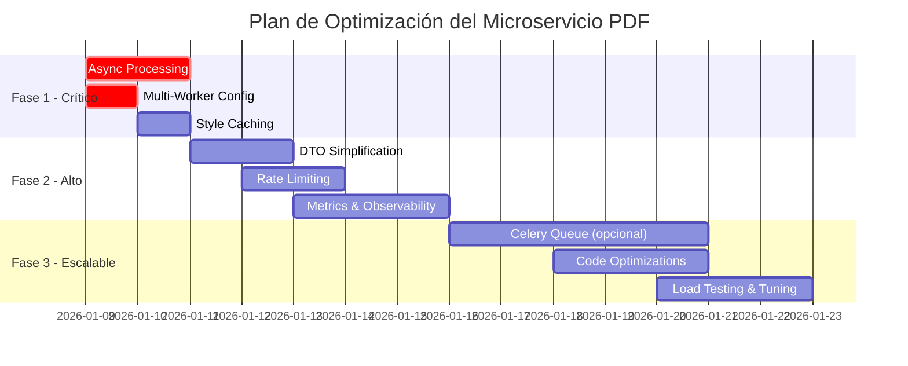

# PDF Export Microservice

[](https://python.org)
[](https://fastapi.tiangolo.com)
[](https://www.reportlab.com)

Microservicio de exportación de PDFs construido con **FastAPI** y **ReportLab**, siguiendo los principios de **Clean Architecture**.

---

## 📋 Tabla de Contenidos

- [Arquitectura](#-arquitectura)
- [Estructura del Proyecto](#-estructura-del-proyecto)
- [Tecnologías](#-tecnologías)
- [Instalación](#-instalación)
- [Uso](#-uso)
- [Documentación](#-documentación)
- [Testing](#-testing)
- [Docker](#-docker)
- [Contribución](#-contribución)


## 🏗️ Arquitectura

Este proyecto implementa **Clean Architecture** (también conocida como Arquitectura Hexagonal o Ports & Adapters), propuesta por Robert C. Martin (Uncle Bob).

### ¿Qué es Clean Architecture?

Clean Architecture es un patrón de diseño de software que organiza el código en capas concéntricas, donde las **dependencias siempre apuntan hacia adentro** (hacia el dominio). Esto logra:

- **Independencia de frameworks**: El core de negocio no depende de FastAPI ni ReportLab
- **Testabilidad**: Cada capa se puede testear de forma aislada
- **Independencia de la UI**: Podríamos cambiar de REST a GraphQL sin tocar el dominio
- **Independencia de la BD**: El dominio no sabe cómo se persisten los datos
- **Independencia de agentes externos**: Las reglas de negocio no conocen el mundo exterior

### Diagrama de Capas

```
┌─────────────────────────────────────────────────────────────┐
│                    PRESENTATION LAYER                        │
│              (FastAPI, Controllers, Schemas)                 │
│                                                              │
│  ┌─────────────────────────────────────────────────────┐    │
│  │                 APPLICATION LAYER                    │    │
│  │           (Use Cases, DTOs, Services)                │    │
│  │                                                      │    │
│  │  ┌─────────────────────────────────────────────┐    │    │
│  │  │              DOMAIN LAYER                    │    │    │
│  │  │    (Entities, Value Objects, Interfaces)     │    │    │
│  │  │                                              │    │    │
│  │  │          ⚡ REGLAS DE NEGOCIO ⚡              │    │    │
│  │  │                                              │    │    │
│  │  └─────────────────────────────────────────────┘    │    │
│  │                                                      │    │
│  └─────────────────────────────────────────────────────┘    │
│                                                              │
└─────────────────────────────────────────────────────────────┘
                              ▲
                              │ Implementa
┌─────────────────────────────────────────────────────────────┐
│                  INFRASTRUCTURE LAYER                        │
│        (ReportLab Implementation, Config, Persistence)       │
└─────────────────────────────────────────────────────────────┘
```

### Regla de Dependencia

> **Las dependencias solo pueden apuntar hacia adentro.** Nada en un círculo interno puede saber algo sobre algo en un círculo externo.

```
Presentation → Application → Domain ← Infrastructure
                    ↓
            Domain (Interfaces)
                    ↑
            Infrastructure (Implementaciones)
```

---

## 📁 Estructura del Proyecto

```
Microservicio-PDF/
│
├── src/                              # Código fuente principal
│   ├── main.py                       # Punto de entrada FastAPI
│   │
│   ├── domain/                       # 🔵 CAPA DE DOMINIO
│   │   │                             # El corazón de la aplicación
│   │   │                             # NO depende de NADA externo
│   │   │
│   │   ├── entities/                 # Entidades del dominio
│   │   │   └── pdf_document.py       # Representa un documento PDF
│   │   │
│   │   ├── value_objects/            # Objetos de valor (inmutables)
│   │   │   └── pdf_style.py          # Estilos: márgenes, fuentes, etc.
│   │   │
│   │   ├── exceptions/               # Excepciones del dominio
│   │   │   └── domain_exceptions.py  # Errores de reglas de negocio
│   │   │
│   │   └── interfaces/               # Puertos (Contratos/Interfaces)
│   │       └── pdf_generator_interface.py  # Contrato para generar PDFs
│   │
│   ├── application/                  # 🟢 CAPA DE APLICACIÓN
│   │   │                             # Orquesta los casos de uso
│   │   │                             # Depende SOLO del dominio
│   │   │
│   │   ├── use_cases/                # Casos de uso del sistema
│   │   │   └── generate_pdf.py       # Lógica para generar un PDF
│   │   │
│   │   ├── dto/                      # Data Transfer Objects
│   │   │   └── pdf_request_dto.py    # Datos de entrada/salida
│   │   │
│   │   └── services/                 # Servicios de aplicación
│   │       └── pdf_service.py        # Coordina múltiples casos de uso
│   │
│   ├── infrastructure/               # 🟠 CAPA DE INFRAESTRUCTURA
│   │   │                             # Implementaciones concretas
│   │   │                             # Adapters que implementan los Ports
│   │   │
│   │   ├── pdf/                      # Implementación del generador
│   │   │   └── reportlab_generator.py # Implementa la interfaz con ReportLab
│   │   │
│   │   ├── persistence/              # Repositorios (si se necesitan)
│   │   │   └── __init__.py
│   │   │
│   │   └── config/                   # Configuración de la app
│   │       └── settings.py           # Settings con Pydantic
│   │
│   └── presentation/                 # 🟣 CAPA DE PRESENTACIÓN
│       │                             # Interfaz con el mundo exterior
│       │                             # FastAPI vive aquí
│       │
│       ├── api/                      # Endpoints de la API
│       │   └── v1/                   # Versionado de API
│       │       ├── __init__.py
│       │       └── router.py         # Router principal v1
│       │
│       ├── schemas/                  # Schemas Pydantic
│       │   └── pdf_schemas.py        # Validación de requests/responses
│       │
│       └── dependencies/             # Inyección de dependencias
│           └── container.py          # Contenedor DI
│
├── docs/                             # 📚 Documentación
│   ├── architecture.md               # Explicación de la arquitectura
│   ├── api_design.md                 # Diseño de la API
│   └── development_guide.md          # Guía para desarrolladores
│
├── tests/                            # 🧪 Tests
│   ├── unit/                         # Tests unitarios
│   │   └── __init__.py
│   ├── integration/                  # Tests de integración
│   │   └── __init__.py
│   └── conftest.py                   # Fixtures de pytest
│
├── .env.example                      # Variables de entorno ejemplo
├── .gitignore                        # Archivos ignorados por Git
├── Dockerfile                        # Imagen Docker
├── docker-compose.yml                # Orquestación local
├── pyproject.toml                    # Configuración del proyecto
├── requirements.txt                  # Dependencias pip
└── README.md                         # Este archivo
```

### Explicación de Cada Capa

#### 🔵 Domain Layer (Capa de Dominio)
**Propósito**: Contiene la lógica de negocio pura y las reglas del dominio.

| Directorio | Propósito | Ejemplo |
|------------|-----------|---------|
| `entities/` | Objetos con identidad única | Un documento PDF con ID |
| `value_objects/` | Objetos inmutables sin identidad | Estilos de PDF |
| `exceptions/` | Errores de reglas de negocio | "El tamaño de página no es válido" |
| `interfaces/` | Contratos (Ports) | "Necesito algo que genere PDFs" |

**Regla clave**: Esta capa NO importa NADA de las otras capas.

#### 🟢 Application Layer (Capa de Aplicación)
**Propósito**: Orquesta el flujo de la aplicación y los casos de uso.

| Directorio | Propósito | Ejemplo |
|------------|-----------|---------|
| `use_cases/` | Acciones del sistema | "Generar un PDF de reporte" |
| `dto/` | Objetos de transferencia | Request con datos del PDF |
| `services/` | Coordinadores | Servicio que usa múltiples use cases |

**Regla clave**: Solo depende del dominio. No sabe de FastAPI ni ReportLab.

#### 🟠 Infrastructure Layer (Capa de Infraestructura)
**Propósito**: Implementa los contratos definidos en el dominio.

| Directorio | Propósito | Ejemplo |
|------------|-----------|---------|
| `pdf/` | Generador concreto | ReportLab implementando la interfaz |
| `persistence/` | Repositorios | Guardar PDFs en disco/S3 |
| `config/` | Configuración | Variables de entorno, settings |

**Regla clave**: Implementa las interfaces del dominio (inversión de dependencias).

#### 🟣 Presentation Layer (Capa de Presentación)
**Propósito**: Expone la aplicación al mundo exterior.

| Directorio | Propósito | Ejemplo |
|------------|-----------|---------|
| `api/` | Endpoints REST | POST /api/v1/pdf/generate |
| `schemas/` | Validación | Schemas Pydantic para requests |
| `dependencies/` | Inyección DI | Contenedor de dependencias |

**Regla clave**: Esta capa traduce HTTP ↔ DTOs de aplicación.

---

## 🛠️ Tecnologías

| Tecnología | Versión | Propósito |
|------------|---------|-----------|
| Python | 3.11+ | Lenguaje principal |
| FastAPI | 0.109+ | Framework web async |
| ReportLab | 4.0+ | Generación de PDFs |
| Pydantic | 2.0+ | Validación de datos |
| Uvicorn | 0.27+ | Servidor ASGI |
| pytest | 8.0+ | Testing |
| Docker | 24.0+ | Containerización |

---

## 🚀 Instalación

### Requisitos Previos
- Python 3.11+
- pip o poetry
- Docker (opcional)

### Instalación Local

```bash
# Clonar el repositorio
git clone <repository-url>
cd Microservicio-PDF

# Crear entorno virtual
python -m venv venv
source venv/bin/activate  # Linux/Mac
.\venv\Scripts\activate   # Windows

# Instalar dependencias
pip install -r requirements.txt

# Copiar variables de entorno
cp .env.example .env
```

### Instalación con Docker

```bash
# Construir imagen
docker-compose build

# Iniciar servicio
docker-compose up -d
```

---

## 📖 Uso

### Iniciar el Servidor

```bash
# Desarrollo
uvicorn src.main:app --reload --host 0.0.0.0 --port 8000

# Producción
uvicorn src.main:app --host 0.0.0.0 --port 8000 --workers 4
```

### Acceder a la Documentación

- **Swagger UI**: http://localhost:8000/docs
- **ReDoc**: http://localhost:8000/redoc
- **OpenAPI JSON**: http://localhost:8000/openapi.json

---

## 📚 Documentación

Documentación detallada disponible en el directorio `/docs`:

| Documento | Descripción |
|-----------|-------------|
| [architecture.md](docs/architecture.md) | Explicación detallada de Clean Architecture |
| [api_design.md](docs/api_design.md) | Diseño y especificación de la API |
| [development_guide.md](docs/development_guide.md) | Guía para desarrolladores |

---

## 🧪 Testing

```bash
# Ejecutar todos los tests
pytest

# Con cobertura
pytest --cov=src --cov-report=html

# Solo tests unitarios
pytest tests/unit/

# Solo tests de integración
pytest tests/integration/
```

---

## 🐳 Docker

### Comandos Útiles

```bash
# Construir imagen
docker-compose build

# Iniciar servicios
docker-compose up -d

# Ver logs
docker-compose logs -f

# Detener servicios
docker-compose down

# Reconstruir y reiniciar
docker-compose up -d --build
```

---

## 📝 Cambios Recientes Implementados

### Refactorización a Clean Architecture (Enero 2026)
- ✅ Reestructuración completa del proyecto siguiendo Clean Architecture ortodoxa
- ✅ Eliminación de la capa redundante `application/services`
- ✅ Movimiento de la lógica de conversión de DTOs a los Use Cases
- ✅ Clarificación de la distinción entre HTTP Schemas (Pydantic) y DTOs internos
- ✅ Actualización de la inyección de dependencias para usar directamente Use Cases

### Mejoras en Generación de PDFs
- ✅ Implementación de endpoint `/api/v1/pdf/generate/comprobante_postulacion`
- ✅ Diseño profesional con elementos narrativos (no solo tablas)
- ✅ Formato de fechas en español argentino
- ✅ Estructura mejorada: header con logo, tabla compacta, mensaje narrativo, firma y footer
- ✅ Estilos modernos con soporte para elementos narrativos

### Configuración Docker
- ✅ Docker Compose configurado para instalación automática de dependencias
- ✅ Servicio completamente containerizado sin necesidad de venv local
- ✅ Dockerfile optimizado con multi-stage build

### Documentación
- ✅ README detallado con explicación de Clean Architecture
- ✅ Documentación de la estructura del proyecto
- ✅ Ejemplos de uso y guías de desarrollo
- ✅ Análisis de optimización de rendimiento (ver `docs/performance_optimization_analysis.md`)

---

## 🚀 Próximas Optimizaciones

> [!IMPORTANT]
> **Estado de Rendimiento**: El sistema actual está optimizado para cargas ligeras pero **requiere optimizaciones significativas** para manejar 100,000+ requests. Ver [análisis completo](docs/performance_optimization_analysis.md) para detalles.

### Fase 1: Optimizaciones Críticas (1-2 días) 🔴

#### 1.1 Procesamiento Asíncrono Real
**Prioridad**: CRÍTICA | **Impacto**: 5-10x throughput

- [ ] Implementar `asyncio.to_thread()` en endpoints para desbloquear el event loop
- [ ] Mover generación de PDF a thread pool
- [ ] Evaluar implementación de Celery + Redis para procesamiento en cola

**Estado**: No implementado  
**Beneficio**: Elimina bloqueo del event loop durante generación de PDFs

---

#### 1.2 Configuración Multi-Worker con Gunicorn
**Prioridad**: CRÍTICA | **Impacto**: 4-8x throughput

- [ ] Migrar de Uvicorn standalone a Gunicorn + UvicornWorker
- [ ] Configurar workers basados en CPU cores: `(2 × cores) + 1`
- [ ] Ajustar timeouts y configuración de producción

**Estado**: No implementado (actualmente 1 worker)  
**Beneficio**: Aprovechamiento de múltiples cores de CPU

---

#### 1.3 Caché de Estilos PDF
**Prioridad**: ALTA | **Impacto**: 20-30% reducción de latencia

- [ ] Implementar singleton para estilos PDF
- [ ] Usar `@lru_cache` para configuraciones de estilos
- [ ] Cachear templates de secciones estáticas

**Estado**: No implementado (estilos se recrean en cada request)  
**Beneficio**: Reducción de ~20-40ms por request

---

### Fase 2: Optimizaciones Altas (3-5 días) 🟡

#### 2.1 Simplificación de Mapeo de DTOs
**Prioridad**: ALTA | **Impacto**: 10-20% reducción de latencia

- [ ] Reemplazar mapeo manual (89 líneas) con `model_dump()`
- [ ] Usar `model_validate()` de Pydantic para conversiones
- [ ] Evaluar eliminación de DTOs redundantes

**Estado**: Mapeo manual actual  
**Beneficio**: Reducción de tiempo de CPU y código más mantenible

---

#### 2.2 Rate Limiting y Protección
**Prioridad**: MEDIA | **Impacto**: Protección contra sobrecarga

- [ ] Implementar `slowapi` o middleware custom
- [ ] Configurar límites por IP y por endpoint
- [ ] Agregar throttling configurable

**Estado**: No implementado  
**Beneficio**: Protección contra DDoS y gestión de carga

---

#### 2.3 Métricas y Observabilidad
**Prioridad**: MEDIA | **Impacto**: Operacional crítico

- [ ] Integrar Prometheus para métricas
- [ ] Implementar logging estructurado
- [ ] Agregar tracing con Jaeger (opcional)
- [ ] Dashboard Grafana para monitoreo

**Estado**: No implementado  
**Beneficio**: Visibilidad de rendimiento y debugging

---

### Fase 3: Arquitectura Escalable (1-2 semanas) 🟢

#### 3.1 Sistema de Colas Asíncrono (Opcional)
**Prioridad**: BAJA | **Impacto**: Escalabilidad horizontal

- [ ] Implementar Celery para procesamiento en background
- [ ] Configurar Redis como message broker
- [ ] API: retornar Task ID, cliente consulta status
- [ ] Almacenamiento temporal en S3/MinIO

**Estado**: No implementado  
**Beneficio**: Desacoplamiento total, retry automático, escalabilidad

---

#### 3.2 Optimizaciones de Código
**Prioridad**: BAJA | **Impacto**: 1.2-2x mejora

- [ ] Optimizar parsing de fechas con caché
- [ ] Eliminar validaciones redundantes
- [ ] Implementar streaming de respuestas con chunks
- [ ] Pool de recursos para generación paralela

**Estado**: Parcialmente implementado  
**Beneficio**: Mejoras incrementales en latencia

---

### Capacidad Estimada

| Configuración | Requests/Segundo | 100K Requests |
|---------------|------------------|---------------|
| **Actual** (1 worker, síncrono) | 2-10 | 2.7-14 horas |
| **Fase 1** (multi-worker + async) | 50-150 | 11-33 minutos |
| **Fase 2** (+ cache + rate limit) | 100-250 | 6-16 minutos |
| **Fase 3** (+ cola asíncrona) | 200-500 | 3-8 minutos |

> [!NOTE]
> Estas son estimaciones teóricas. Se requiere load testing con Locust/k6 para validar números reales.

---

## 📊 Roadmap de Desarrollo



---

## 🔗 Enlaces Útiles

- [Análisis Completo de Rendimiento](docs/performance_optimization_analysis.md)
- [Guía de Arquitectura](docs/architecture.md)
- [Diseño de API](docs/api_design.md)
- [Guía de Desarrollo](docs/development_guide.md)

---

## 📞 Contribución

Para contribuir al proyecto, por favor:

1. Fork el repositorio
2. Crea una rama para tu feature (`git checkout -b feature/AmazingFeature`)
3. Commit tus cambios (`git commit -m 'Add some AmazingFeature'`)
4. Push a la rama (`git push origin feature/AmazingFeature`)
5. Abre un Pull Request

---

## 📄 Licencia

Este proyecto está bajo la licencia [MIT](LICENSE).